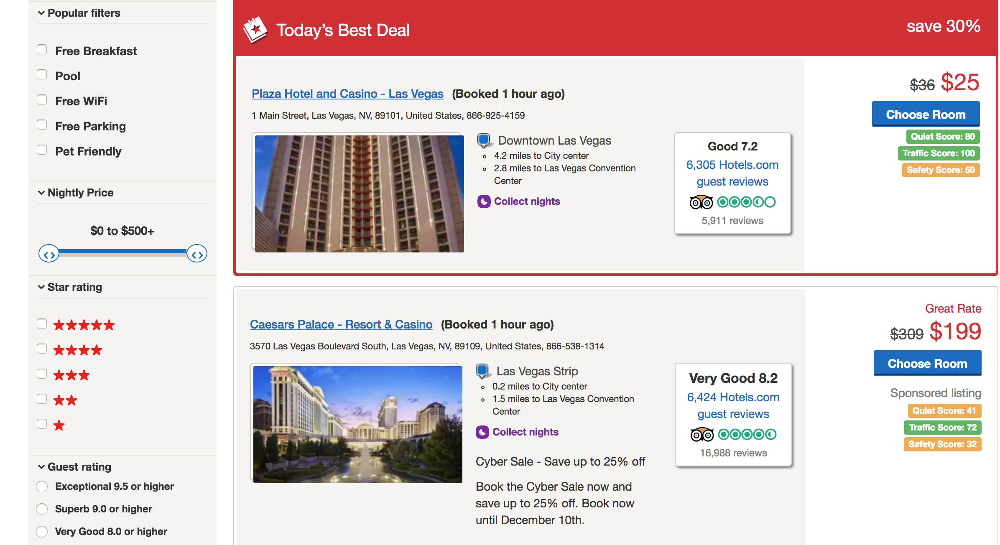

# HomeSafety

A chrome extension that gives a neighbourhood safety, quietness, and traffic score to hotel listings on hotel.com. Score calculated by LibertyManual's shineAPI.

## Motivation

As students travelling to another country for a hackathon, we were willing to sacrifice comfort or some hotel facilities for a discount. However, we still wanted to spend the night in a relatively safe neighbourhood. Manually comparing maps of crime or traffic accidents to hotel locations was stressful and time-consuming - a problem that HomeSafety would solve.

## Demo

